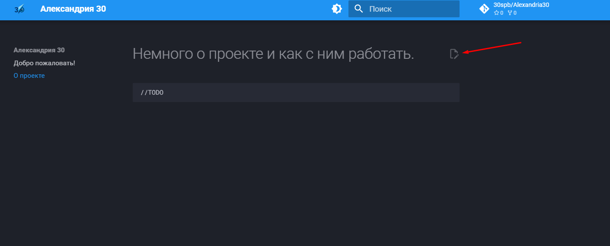

# Немного о проекте и как с ним работать.

В данной статье будут затронуты некоторые технические моменты, которые полезно знать если вы хотите внести свой вклад.

## Как мне добавить свой конспект?

Александрия работает на платформе [github](https://github.com), все конспекты лежат там же в формате [markdown](https://ru.wikipedia.org/wiki/Markdown). 


!!! note
    Ознакомьтесь с markdown хотя бы чуток, имея базовые познания можно сделать свой конспект в разы красивее! <br>
    [Видео гайд на 20 минуток](https://www.youtube.com/watch?v=jPKi2Addbxw) <br>
    [Краткий экскурс в текстовом формате](https://doka.guide/tools/markdown/)


Для начала нужно переписать свой конспект в этом формате. <br>

1. Если он содержит какие-либо фотографии, их тоже нужно подготовить: <br>
    1. Название фотографии должно отражать ее содержимое (если на фото котик, то лучше ее назвать cat.png, а не photo_1984_02_31_telegram.png) <br>
    2. Желательно отредачить фотку что бы на ней не было никакой лишней инфы и она была в приличном качестве <br>
2. В конце нужно будет подписать свое детище: <br>
    1. Нужно оставить имя <br>
    2. И контакт для связи <br>
    3. По желанию можно закончить эпичной фразой =) <br>

### Я не знаю что такое github, markdown

Ничего страшного! Сообщите [администрации Александрии](./admins.md) о вашем желании помочь, она в свою обьяснит поподробнее что нужно сделать. С вас только знания, технические моменты мы возьмем на себя ❤️

### Я знаю что такое github и markdown ( advanced )

Супер! Первое что вам нужно сделать это создать форк всей Александрии.

!!! note 
    Что бы не потеряться в знаниях учеников 30ки мы будем сортировать конспекты по предметам, разделам и тд. <br>
    Например конспекты по математической логике могут лежать в папке docs/algebra/logic/...

Если ваш предмет и раздел этого предмета уже есть в Александрии то добавляйте конспект в соответствующую папку, в противном случае добавьте папку для предмета или его раздела.

!!! note
    Потеряться в фотках еще проще чем в конспектах! Поэтому их мы тоже будем сортировать по папкам (внутри папки assets, там лежат вообще все медиа-файлы). Причем путь до фотки будет такой же как до конспекта <br>
    Например фотография квантора для конспекта по мат. логике из примера выше будет лежать по пути docs/assets/algebra/logic/quantifier.png

Если ваш конспект содержит фотографии, то добавьте их в папку docs/assets. [Гайд как добавить фотку](https://www.mkdocs.org/user-guide/writing-your-docs/#linking-to-images-and-media) (у них используется папка img вместо нашей assets).

Затем нужно подправить конфиг (mkdocs.yml) всего проекта и прописать там ваш конспект.

Нас интересует секция nav.
```yaml
nav:
  - Добро пожаловать!: index.md
  - О проекте: about/index.md
```

!!! note
    Когда мы работаем в конфиге, то все пути прописаны относительно папки docs (как если бы она являлась корнем), поэтому мы пишем не `docs/about/index.md`, а  `about/index.md`

Например, если мы хотим добавить конспект по мат. логике то делать это нужно следующим образом
```yaml
nav:
  - Добро пожаловать!: index.md
  - О проекте: about/index.md
  - Алгебра:
    - Логика:
      - Кванторы: algebra/logic/quantifier.md
```

!!! note
    Пожалуйста, пишите, что конкретно вы поменяли или добавили при пулл-реквесте. Так будет намного проще проверить изменения и поскорее принять их в работу!

Осталось только создать пулл-реквест и ждать пока администрация Александрии примет ее!

## Как поправить ошибку в существующем конспекте?

Можно написать [администрации](./admins.md) об ошибке, она свяжется с автором и уладит проблему. Так-же можно написать автору, может это и вовсе не ошибка.

### Исправить самому ( advanced )

Вверху конспекта можно найти такую вот кнопочку



После нажатия вас перенес на гитхаб Александрии и откроет файл с исходным кодом того конспекта. Опять же делаем форк Александрии, убираем ошибку, делаем пулл-реквест и пишем что конкретно поменяли. Процесс работы с гитхабом подробнее написан [тут](#я-знаю-что-такое-github-и-markdown--advanced).

| Author         | Contact                       | Date       |
|----------------|-------------------------------|------------|
| Лавелин Михаил | [Tg](https://t.me/mikhaillav) | 02.11.2024 |