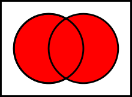

# Теоретико-множественные операции

## Пересечение {#определение-пересечения}

**Пересечением множеств A и B** называется множество, обозначаемое как $A \cap B$ и состоящее из тех и только тех элементов, которые принадлежат к множеству A и B одновременно.

$A \cap B = \{\mspace{5mu} x \mspace{5mu} | \mspace{5mu} (x \in A) \wedge (x \in B) \mspace{5mu} \}$

{ loading=lazy }

## Объединение {#определение-объединения}

**Объединением множеств A и B** называется множество, обозначаемое как $A \cup B$ и состоящее из тех элементов, которые принадлежат хотя бы к одному из множеств A или B.

$A \cup B = \{\mspace{5mu} x \mspace{5mu} | \mspace{5mu} (x \in A) \lor (x \in B) \mspace{5mu} \}$

{ loading=lazy }

## Теоретико-множественная разность {#определение-теоретико-множественной-разности}

**Теоретико-множественной разностью множеств A и B** называется множество, обозначаемое как $A \setminus B$ и состоящее из тех и только тех элементов, которые принадлежат множеству A и не принадлежат множеству B.

$A \setminus B = \{\mspace{5mu} x \mspace{5mu} | \mspace{5mu} (x \in A) \wedge \neg (x \in B) \mspace{5mu} \}$

{ loading=lazy }

---
| Author         | Contact                       | Role     |
|----------------|-------------------------------|----------|
| Ренёв О.В.     |                               | Автор    |
| Лавелин Михаил | [Тг](https://t.me/mikhaillav) | Редактор |
