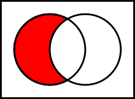

# Теоретико-множественные операции

## Пересечение {#определение-пересечения}

**Пересечением множеств A и B** называется множество, обозначаемое как A ∩ B и состоящее из тех и только тех элементов, которые принадлежат к множеству A и B одновременно.

**A ∩ B = { x | (x ∈ A) ∧ (x ∈ B) }**

{ loading=lazy }

## Объединение {#определение-объединения}

**Объединением множеств A и B** называется множество, обозначаемое как A ∪ B и состоящее из тех элементов, которые принадлежат хотя бы к одному из множеств A или B.

**A ∪ B = { x | (x ∈ A) ∨ (x ∈ B) }**

{ loading=lazy }

## Теоретико-множественная разность {#определение-теоретико-множественной-разности}

**Теоретико-множественной разностью множеств A и B** называется множество, обозначаемое как A \ B и состоящее из тех и только тех элементов, которые принадлежат множеству A и не принадлежат множеству B.

**A \ B = { x | (x ∈ A) ∧ ¬(x ∈ B) }**

{ loading=lazy }

---
| Author         | Contact                       | Role     |
|----------------|-------------------------------|----------|
| Ренёв О.В.     |                               | Автор    |
| Лавелин Михаил | [Тг](https://t.me/mikhaillav) | Редактор |