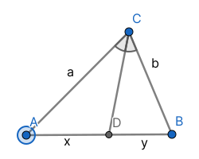
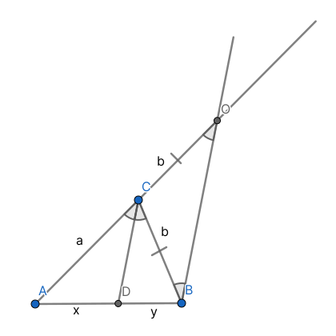
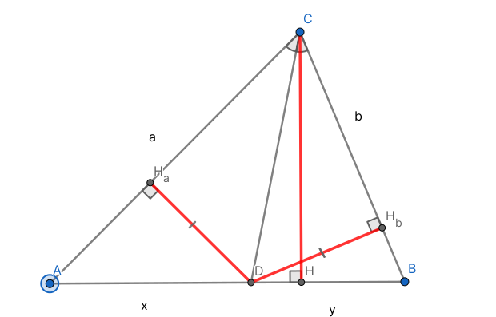

# Свойство биссектрисы треугольника

## Формулировка {#формулировка}

Биссектриса угла делит противоположную сторону в отношении, равном отношению длин прилежащих сторон

## Доказательство {#доказательство}

<figure markdown="span">
    
    <figcaption>Доказать, что $\frac{a}{b} = \frac{x}{y} ($ или $\frac{a}{x} = \frac{b}{y})$</figcaption>
</figure>

### 1 cпособ {#1-способ}

Сделаем дополнительное построение

<figure markdown="span">
    
    <figcaption>*BO* || *CD*; *O* ∈ [*AC*)</figcaption>
</figure>

$\angle CBO = \angle DCB$ накрест-лежащие; $\angle COB = \angle DCB$ соответсвенные, значит $\angle COB = \angle CBO$. Тогда *△BCO* - равнобедренный по признаку, следовательно |*CB*| = |*CO*|

По теореме Фалеса:

$\begin{array}{ll}
    \frac{|AC|}{|CO|} = \frac{|AD|}{|DB|} \iff \\
    \frac{a}{b} = \frac{x}{y} \iff \\
    \frac{a}{x} = \frac{b}{y}
\end{array}$

Что и требовалось доказать

### 2 cпособ {#2-способ}

Проведем высоты из точки *D* к сторонам *a* и *b*, из точки *C* к стороне *AB*

<figure markdown="span">
    
</figure>

Площадь треугольника равна полупроизведению основания на высоту. У треугольников *△CDA* и *△CDB* высота *СH* общая, тогда $\frac{x}{y} = \frac{S(△CDA)}{S(△CDB)}$

Из характеристического свойства биссектрисы угла, *D* равноудалена от *AC* и *BC*, то есть |*DH*$_a$| = |*DH*$_b$|. Аналогично получаем $\frac{S(△CDA)}{S(△CDB)} = \frac{a}{b}$, значит $\frac{a}{b} = \frac{x}{y}$, что и требовалось доказать

### 3 способ {#3-способ}

$\angle$ ADC и $\angle$ CDB - смежные, а значит их синусы равны

$\angle$ ACD и $\angle$ DCB - равные, а значит их синусы равны

Пусть d = CD

$S(△ACD) = \frac{1}{2} \cdot xd \cdot \sin \angle ADC = \frac{1}{2} \cdot ad \cdot \sin \angle ACD \Rightarrow$   
$x \cdot \sin \angle ADC = a \cdot \sin \angle ACD \iff$   
$\frac{a}{x} = \frac{\sin \angle ADC}{\sin \angle ACD}$

Аналогично

$S(△BCD) = \frac{1}{2} \cdot yd \cdot \sin \angle BDC = \frac{1}{2} \cdot bd \cdot \sin \angle BCD \Rightarrow$   
$y \cdot \sin \angle BDC = b \cdot \sin \angle BCD \iff$   
$\frac{b}{y} = \frac{\sin \angle BDC}{\sin \angle BCD} \iff$   
$\frac{b}{y} = \frac{\sin \angle ADC}{\sin \angle ACD} = \frac{a}{x}$
  

