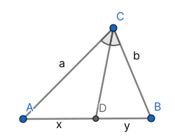
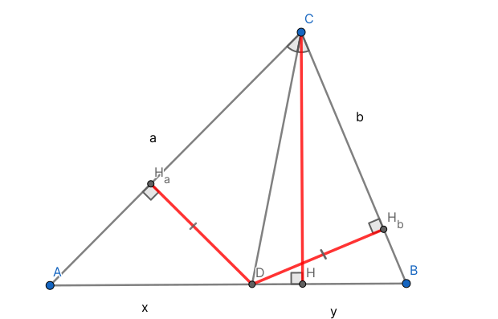

# Свойство биссектрисы треугольника

## Формулировка {#формулировка}

Биссектриса угла делит противоположную сторону в отношении, равном отношению длин прилежащих сторон

## Доказательство {#доказательство}

<figure markdown="span">
    
    <figcaption>Доказать, что $\frac{a}{b} = \frac{x}{y} ($ или $\frac{a}{x} = \frac{b}{y})$</figcaption>
</figure>

### 1 cпособ {#1-способ}

Сделаем дополнительное построение

<figure markdown="span">
    
    <figcaption>*BO* || *CD*; *O* ∈ [*AC*)</figcaption>
</figure>

$\angle CBO = \angle DCB$ накрест-лежащие; $\angle COB = \angle DCB$ соответсвенные, значит $\angle COB = \angle CBO$. Тогда *△BCO* - равнобедренный по признаку, следовательно |*CB*| = |*CO*|

По теореме Фалеса:

$\begin{array}{ll}
    \frac{|AC|}{|CO|} = \frac{|AD|}{|DB|} \iff \\
    \frac{a}{b} = \frac{x}{y} \iff \\
    \frac{a}{x} = \frac{b}{y}
\end{array}$

Что и требовалось доказать

### 2 cпособ {#2-способ}

Проведем высоты из точки *D* к сторонам *a* и *b*, из точки *C* к стороне *AB*

<figure markdown="span">
    
</figure>

Площадь треугольника равна полупроизведению основания на высоту. У треугольников *△CDA* и *△CDB* высота *СH* общая, тогда $\frac{x}{y} = \frac{S(△CDA)}{S(△CDB)}$

Из характеристического свойства биссектрисы угла, *D* равноудалена от *AC* и *BC*, то есть |*DH*$_a$| = |*DH*$_b$|. Аналогично получаем $\frac{S(△CDA)}{S(△CDB)} = \frac{a}{b}$, значит $\frac{a}{b} = \frac{x}{y}$, что и требовалось доказать

Над статьей работали:

- Чухалёнок Алексей ([Тг](https://t.me/AlexeyRoot)): редактор
- Валентин Андреевич ([Страничка в тридцатке](https://school30.spb.ru/staff/~evstafyevva.shtml)): магистр-джедай

