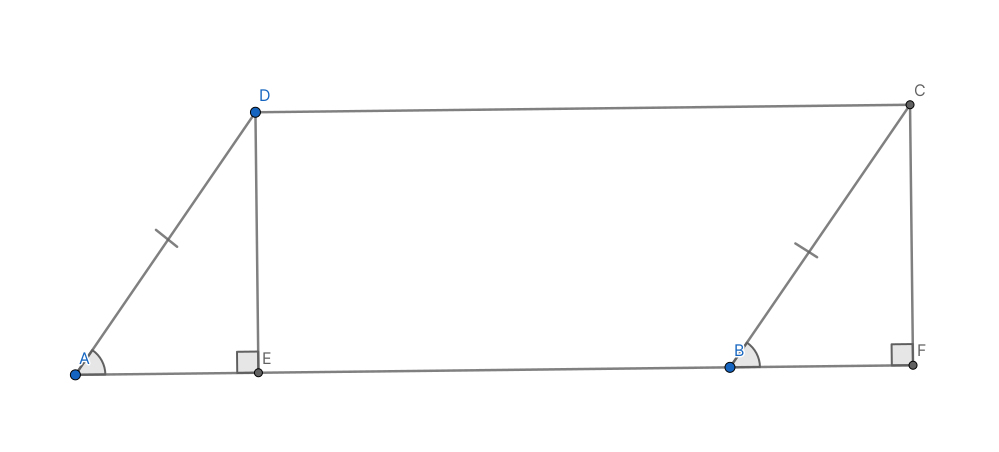
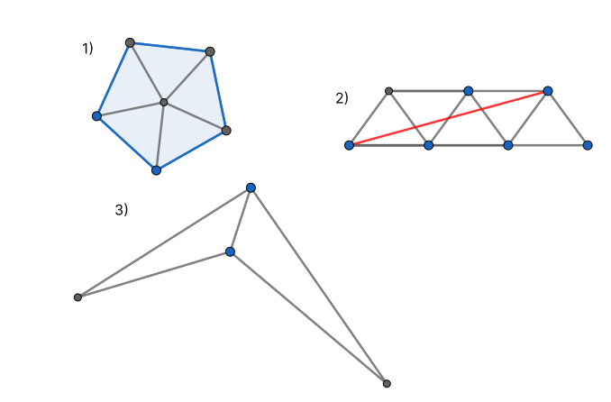
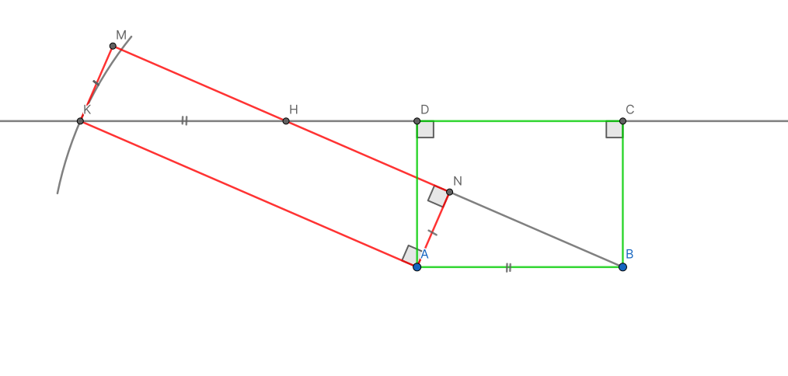

# Теорема Бояй-Гервина

!!! note "Заметка"

    Эту теорему почти одновременно и независимо друг от друга доказали венгерский математик Фаркаш Бояй (он сделал это первым в 1832) и немецкий офицер Гервин (годом позже)

    В завсимости от источника, можно встретить написание "Бойай" или "Бояй"

## Определения {#определения}

Для форулировки данной теоремы необходимо ввести следующие определния:

**Равновеликими** называются фигуры с одинаковой площадью

Если взять одну из двух фигур, определенным образом разрезать её на конечное количество частей и из этих частей собрать вторую фигуру, то эти фигуры будут называться **равносоставленными**

<figure markdown="span">
    
    <figcaption>Прямоугольник *AHCD* и треугольник *△ABC* - равновеликие</figcaption>
</figure>

## Формулировка {#формулировка}

То, что 2 многоугольника являются равносоставленными необходимо и достаточно для того, чтобы они являлись равновеликими

## Доказательство {#доказательство}

Прямое утверждение достаточно очевидное и доказывается свойством площадей. Для доказательства обратного потребуются большие усилия

### Лемма 1 {#лемма1}

Любому треугольнику можно сопоставить равносоставленный с ним параллелограмм

Для этого достаточно вспомнить дополнительное построение к теореме о средней линии треугольника

### Лемма 2 {#лемма2}

Каждому параллелограмму соответствует равносоставленный с ним прямоугольник

Для этого из большего угла параллелограмма $\angle D$ и соотвественного с ним $\angle С$ опустим высоты к противоположному основанию. Тогда прямоугольник *EFCD* - равносоставленный с параллелограммом *ABCD*

### Лемма 3 (транзитивность) {#лемма3-транзитивность}

Если:

Ф~1 и Ф~2 равносоставленные
Ф~2 и Ф~3 равносоставленные

то

Ф~1 и Ф~3 равносоставленные

Действительно, сначала разрежем 2ю фигуру так, чтобы из этих кусочков можно было собрать 1ю, а потом, не двигая эти кусочки, разрезать их, чтобы получить 3ю фигуру. Тогда и 1я и 2я будут состоять из более мелких, чем изначально, кусочков 2й фигуры

### Лемма 4 {#лемма4}

Два параллелограмма с равным основанием и высотой, проведенной к этому основанию - равносоставленные

Для доказательства сделаем дополнительное построение: проведем полосу, с данной высотой. На одной из параллельных прямых отложим несколько отрезков, равных основанию параллеллограмма и на каждом из них построим 2 данных паралеллограмма

Далее, пользуясь параллельными прямыми, нетрудно доказать, что они состоят из одинаковых фигур

!!! note "Заметка"

    Для доказательства можно воспользоваться равенством накрест-лежащих, соответственных углов, свойствами параллелограммов, теоремой Фалеса

<figure markdown="span">
    
    <figcaption>Теорема Фалеса работает не только для одной прямой, но и для целого семейства параллельных ей</figcaption>
</figure>

### Лемма 5 {#лемма5}

Равновеликие прямоугольники равносоставленные

Пусть нам даны прямоугольники равной площади *ABCD* и *ANMK* и сторона *a* прямоугольника ANMK самая длинная.

Возмьем прямоугольник *ABCD* (т. к. его стороны не самые длинные), построим из него полосу. Теперь, построим точку *K*, лежащую на *(CD)*, удаленную от точки *A* на расстояние, равное *a*. Это возможно, т. к. *a* больше чем высота *AD*.

Теперь построим параллелограмм *ABHK*. Он и *ABCD* - равносоставленные в силу [4 леммы](#лемма4).

Теперь мы перестроим параллелограм в прямоугольник *ANMK* по алгоритму из [2й леммы](#лемма2), и, поскольку *AK* - большая, то высота останется такой же. Поскольку получившиеся прямоугольники *ABCD* и *ANMK* равносоставленные в силу [транзитивности](#лемма3-транзитивность), значит их площади равны.

Тогда *AN* равна S(*ABCD*) / *a*, что равно стороне исходного прямоугольника.

### Финальный шаг {#финал}

Каждый многоугольник можно разбить на треугольники

Каждому треугольнику соответствует равносоставленный с ним параллелограмм ([Лемма 1](#лемма1)). Кажому параллелограмму соответсвует равносоставленный с ним прямоугольник

Все прямоугольники можно привести к общей стороне (каждому прямоугольнику соответствует равносоставленный с ним прямоугольник с заданной стороной)

Путем равносоставления фигур мы разбили многоугольники на прямоугольники. Прямоугольники, полученные из обоих фигур, мы привели к общей стороне, и составили из них 2 больших прямоугольника (1й получен из 1й фигуры, 2й из 2й)

Эти прямоугольники равносоставленны с исходными фигурами, значит их площади равны, но если их площади равны, и одна из сторон равна, то, поскольку *S = ab*, другие стороны тоже равны. Значит эти фигуры равны

Пользуясь [транзитивностью](#лемма3-транзитивность) мы получаем, что исходные фигуры равносоставленные

---
| Author            | Contact                       | Role     |
| ----------------- | ----------------------------- | -------- |
| Болтянский В. Г.  |                               | Автор    |
| Чухалёнок Алексей | [Тг](https://t.me/AlexeyRoot) | Редактор |
