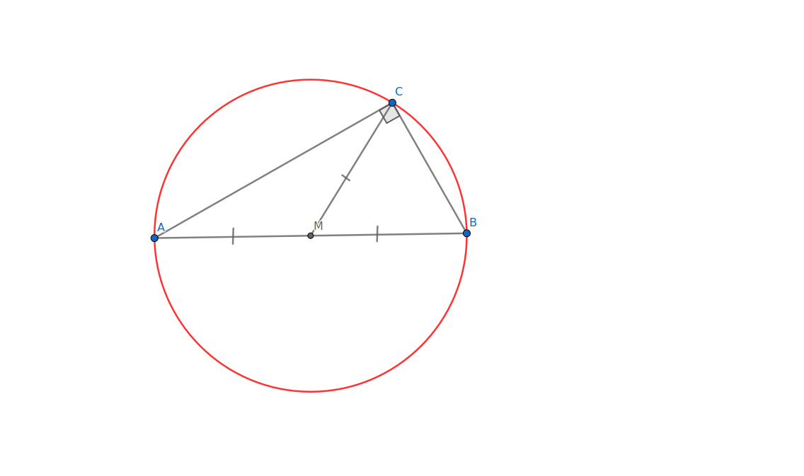
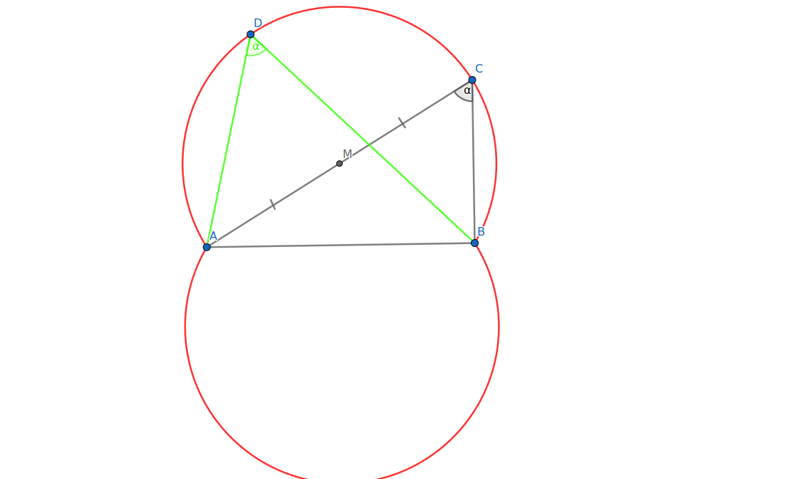
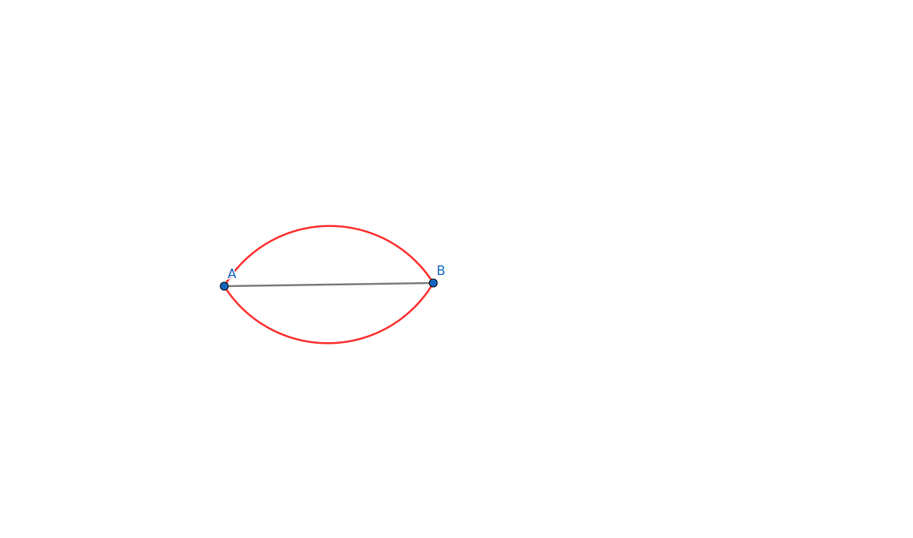
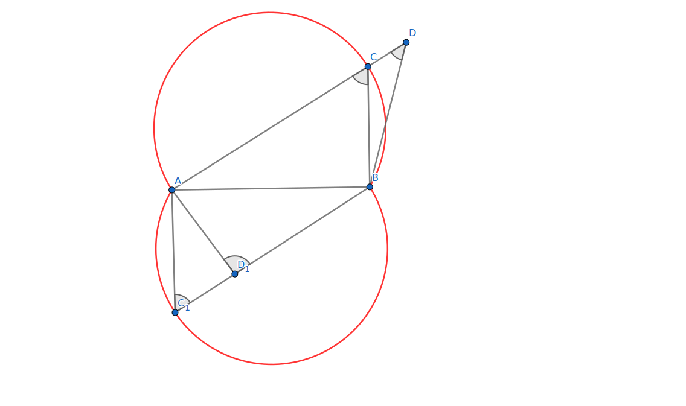

# Геометрическое место точек из которых данный отрезок виден под данным углом

## 1 случай: прямой угол {#прямой-угол}

На отрезке построим окружность, как на диаметре

Тогда для любой произвольной точки *C* на этой окружности, кроме точек *A* и *B*, *∆ABC* - прямоугольный по признаку (медиана, проведенная к гипотенузе равна ее половине)

## 2 случай: острый угол {#острый-угол}

В таком случае из точки *A* построим угол $\angle CAB = 90° - α$, при этом точка *C* такая что *CB* ⊥ *AB*. Построим окружность на *AC*, как на диаметре, и выберем большую дугу *◡AB*. С другой стороны *AB* сделаем аналогичное построение

Для любой точки *D*, лежащей на больших дугах *◡AB*, не являющейся точками *A* или *B*, $\angle D = \angle C$, т. к. они - вписанные углы и опираются на одну и ту же хорду.
При этом меньшие дуги *◡AB* не будут подходить, ведь предыдущее утверждение будет верным только для углов, лежащих по одну сторону от хорды *AB*, в противном случае эти углы в сумме будут составлять 180°. Этим мы и воспользуемся для следующего случая

## 3 случай: тупой угол {#тупой-угол}

Как и говорилось, вписанные углы, опирающиеся на одну и ту же хорду или равны, или в сумме составляют 180°. В предыдущем случае мы создавали равные углы, в этом случае поступим иначе и вместо больших дуг, возьмем меньшие (опять же без точек *A* и *B*)

## Доказательство, что других случаев нет

Предположим, что есть такая точка *D*, которая не пренадлежит этому ГМТ, но при этом *AB* тоже виден из нее под углом α. Проведем прямую между концом отрезка и точкой *D*, она пересечется с нашим множеством точек. Тогда внешний угол треугольника будет равен внутреннему, несмежному с ним, что невозможно

