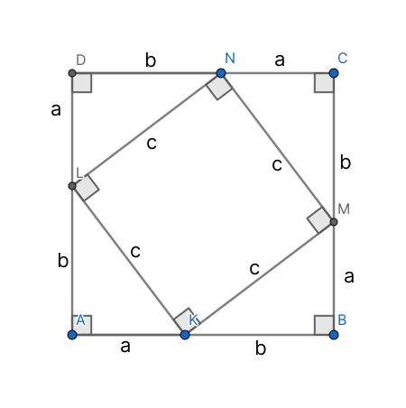
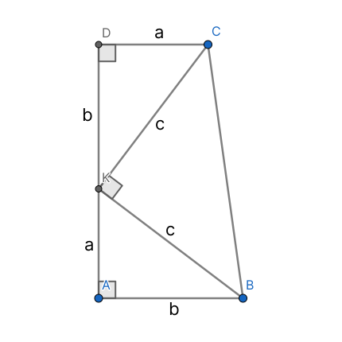
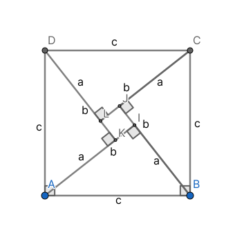
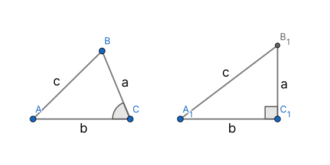

# Теорема Пифагора

!!! note "Заметка"
    Данная теорема была помечена как *судьбоносная* несколькими учителями тридцатки

!!! note "Заметка"
    В этой статье представлены самые простые способы доказательства

## Формулировка {#формулировка}

В прямоугольном, и только в прямоугольном треугольнике квадрат длины гипотенузы равен сумме квадратов длин катетов

## Доказательство {#доказательство}

<figure markdown="span">
    
    <figcaption>Дан прямоугольный треугольник с гипотенуузой *c*, катетами *a* и *b*</figcaption>
</figure>

## Прямое утверждение {#прямое-утверждение}

В прямоугольном треугольнике квадрат длины гипотенузы равен сумме квадратов длин катетов

### 1 способ {#способ1}

Сделаем дополнительное построение

<figure markdown="span">
    
    <figcaption>Квадрат со стороной *a* + *b*</figcaption>
</figure>

Треугольники *△AKL*, *△BMK*, *△CNM* и *△DLN* равны по 2м катетам

*KMNL* тоже квадрат, поскольку острые углы в прямоугольном треугольнике в сумме дают 90° и все стороны равны *c*

С одной стороны площадь *ABCD* равна произведению его сторон

$(a + b)^2 = a(a + b) + b(a + b) = a^2 + 2ab + b^2$

<figure markdown="span">
    
    <figcaption>$(a + b)^2 = a^2 + 2ab + b^2$</figcaption>
</figure>

С другой стороны равна сумме площадей фигур, из которых он состоит

$4 \cdot \frac{1}{2} \cdot ab + c^2$

Подставим

$\begin{array}{ll}
    a^2 + 2ab + b^2 = 4 \cdot \frac{1}{2} \cdot ab + c^2 \iff \\
    a^2 + 2ab + b^2 = 2ab + c^2 \iff \\
    c^2 = a^2 + b^2
\end{array}$

### способ 2 (доказательство Гарфилда) {#способ2-гарфилд}

Сделаем дополнительное построение

<figure markdown="span">
    
    <figcaption>Прямоугольная трапеция с основаниями *a* и *b*, высотой *a* + *b*</figcaption>
</figure>

Треугольники *△ABK*, *△DKC* равны по 2м катетам

$\angle$*BKC* = 90° т. к. острые углы треугольника в сумме равны 90°

С одной стороны площадь *ABCD* равна произведению полусуммы оснований на высоту

$(a + b) \cdot \frac{a + b}{2} = \frac{(a + b)^2}{2}$

С другой стороны равна сумме площадей фигур, из которых она состоит

$2 \cdot \frac{1}{2} \cdot ab + \frac{1}{2} \cdot c \cdot c = \frac{c^2 + 2ab}{2}$

Подставим

$\begin{array}{ll}
    \frac{(a + b)^2}{2} = \frac{c^2 + 2ab}{2} \iff \\
    a^2 + 2ab + b^2 = 2ab + c^2 \iff \\
    c^2 = a^2 + b^2
\end{array}$

### способ 3 {#способ3}

Сделаем дополительное построение

<figure markdown="span">
    
    <figcaption>Квадрат со стороной *с*. Внутри 4 исходных треугольника, построенных на стороне квадрата, как на гипотенузе</figcaption>
</figure>

*KIJL* тоже квадрат, поскольку все его углы смежные с углами 90° и все стороны равны *a* - *b*

С одной стороны площадь *ABCD* равна произведению его сторон $c^2$

С другой стороны равна сумме площадей фигур, из которых она состоит

$4 \cdot \frac{1}{2} \cdot ab + (a - b)^2 = a^2 + b^2 + 2ab - 2ab = a^2 + b^2$

Получается

$c^2 = a^2 + b^2$

## Обратное утверждение {#обратное-утверждение}

Если в треугольнике со сторонами *a*, *b* и *c* выполняется $c^2 = a^2 + b^2$, то угол напротив *c* - прямой

Предположим что это не так: $\angle C \neq 90^\circ$

Тогда построим треугольник $A_1 B_1 C_1$ так, чтобы $\angle C_1 = 90^\circ; |B_1 C_1| = a; |A_1 C_1| = b$. Тогда $|A_1 C_1| = \sqrt{a^2 + b^2} = |AC|$

*△ABC* = △$A_1 B_1 C_1$ по трем сторонам, но тогда $\angle C = 90^\circ$ - противоречие
