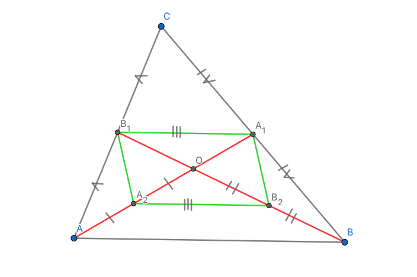

# Теорема о медианах треугольника

## Определение {#определение-медианы}

**Медиана** треугольника - отрезок, соединяющий вершину треугольника и середину противолежащей стороны

<figure markdown="span">
    
    <figcaption>*CM* - медиана</figcaption>
</figure>

## Формулировка {#формулировка}

Медианы треугольника пересекаются в одной точке и делятся в этой точке в соотношеии $\frac{2}{1}$ считая от вершины

## Доказательство {#доказательство}

### 1 способ {#доказательство-1-способ}

*AA1* и *BB1* - медианы

#### Дополнительное построение {#доп-построение-1-способ}

Пусть *A2* - середина *AO*, *B2* - середина *BO*

*A1B1* - по определению, средняя линия треугольника *△ABC*, значит она равна $\frac{AB}{2}$ и параллельна основанию  
*A2B2* - по определению, средняя линия треугольника *△ABO*, значит она равна $\frac{AB}{2}$ и параллельна основанию

Тогда |*A1B1*| = |*A2B2*| и *A1B1* || *A2B2*, значит *A1B1A2B2* - параллелограмм по признаку

По свойству параллелограмма |*A1O*| = |*A2O*|; |*B1O*| = |*B2O*|. Следовательно |*AO*| = 2|*A1O*|; |*BO*| = 2|*B1O*|

Аналогично доказывается для *AA1* и *CC1*; *BB1* и *CC1*

### 2 способ {#доказательство-2-способ}

*AA1* и *BB1* - медианы

#### Дополнительное построение {#доп-построение-2-способ}

*M* ∈ *AB*:  *A1M* || *BB1*

По теореме Фалеса $\frac{|B_1M|}{|MC|} = \frac{|BA_1|}{|A_1C|} = \frac{1}{1}$. Если |*BA1*| = x, то |*MC*| = x, а |*AB1*| = 2x

По теореме Фалеса $\frac{|AO|}{|OA_1|}= \frac{|AB_1|}{|B_1M|} = \frac{2x}{x} = \frac{2}{1}$

Аналогично доказывается для *AA1* и *CC1*; *BB1* и *CC1*

!!! note "Заметка"

    У медианы есть только 1 точка, в которой она делиться в отношении $\frac{2}{1}$, считая от вершины, значит все медианы пересекаются в одной точке

---

Над статьей работали:

- Чухалёнок Алексей ([Тг](https://t.me/AlexeyRoot)): редактор
- Валентин Андреевич ([Страничка в тридцатке](https://school30.spb.ru/staff/~evstafyevva.shtml)): магистр-джедай
