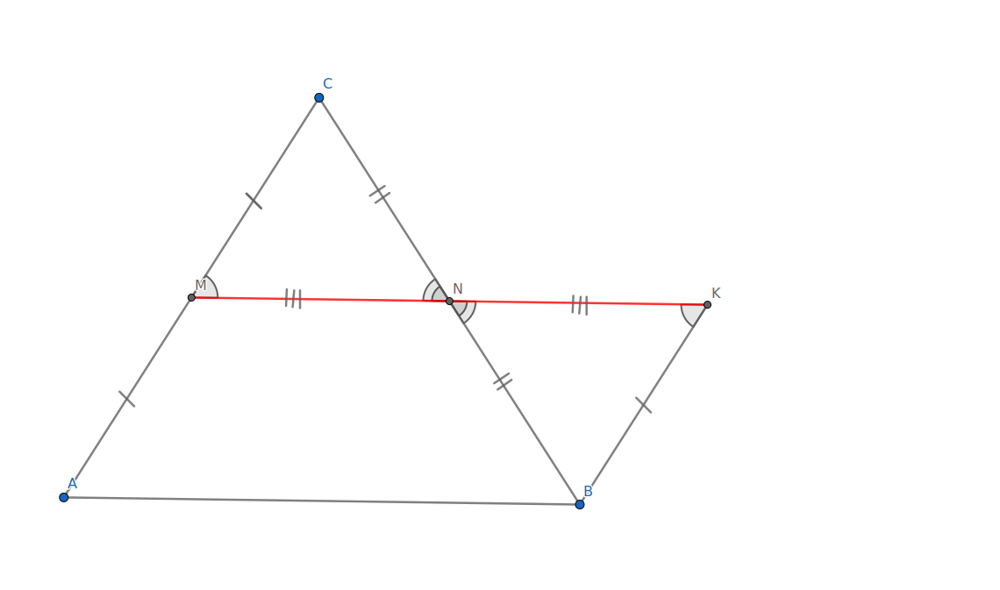

# Средняя линия треугольника

## Определение {#определение}

**Средней линией треуголника** называется отрезок, соединяющий середины двух его сторон

## Свойство средней линии {#свойство}

Средняя линия треугольника параллельна 3й стороне и ее длина равна половине длины 3й стороны

### Доказательство {#доказательство}

Сделаем следующее дополнительное построение, удвоим среднюю линию

*△MNC* = *△KNB* по 2м сторонам и углу между ними, следовательно $\angle CMN = \angle BNK$. *AM* и *BK* равны и паралелльны, значит *AMBK* - параллелограмм, а его стороны параллельны. Но тогда еще |*MK*| = |*AB*|, а поскольку *MK* - это удвоенная средняя линия, то одна средняя линия равна $\frac{AB}{2}$

## Признак средней линии {#признак}

Если в треугольнике отрезок, соединяющий середину одной стороны с точкой на другой, параллелен 3й, то он является средней линией

Предположим, что *MK* не средняя линия, тогда проведем среднюю линию *MN*. Она будет параллельна основанию по [свойству](#свойство-средней-линии-свойство). Но *MK* тоже параллелен основанию. Из одной точки можно провести только 1 прямую, параллельную данной, значит мы пришли к противоречию
